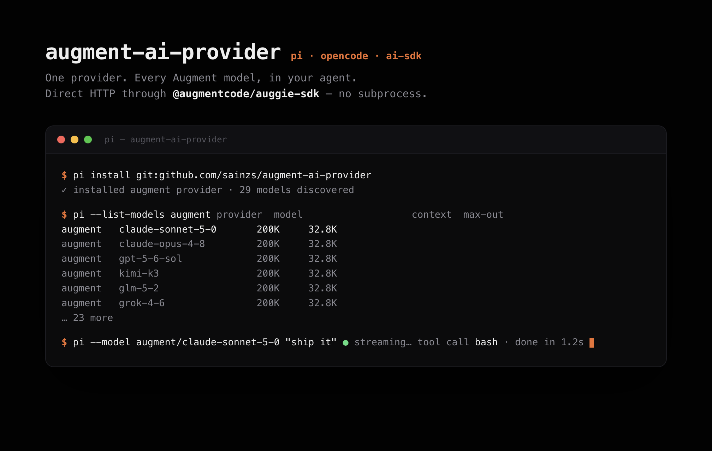

# augment-ai-provider

[](https://github.com/sainzs/augment-ai-provider/actions/workflows/ci.yml)
[](https://www.npmjs.com/package/augment-ai-provider)
[](LICENSE)

Use [Augment Code](https://augmentcode.com) models in [pi](https://pi.dev), OpenCode, and OpenCode 2. Direct HTTP through `@augmentcode/auggie-sdk` — no local `auggie` subprocess.



## Install

```bash
pi install git:github.com/sainzs/augment-ai-provider
```

Requires Node ≥ 18 and an Augment login:

```bash
npm i -g @augmentcode/auggie && auggie login
```

## What it does

- Adds an `augment` provider with your tenant's full model catalog (Claude, GPT, Kimi, GLM, Grok, …)
- Live model discovery with a synced cache and static fallback
- Tool calling, streaming, and reasoning (thinking) pass-through
- Same provider package also works as an AI SDK v3 factory and an OpenCode / OpenCode 2 custom provider

## Usage

In pi, pick an `augment/...` model from the model picker, or run:

```bash
pi --model augment/claude-sonnet-5-0
```

Sync the catalog after Augment adds or retires models:

```bash
augment-ai-provider sync   # or: node bin/sync-models.mjs
```

### AI SDK (direct)

```js
import { createAugment } from "augment-ai-provider";
import { generateText } from "ai";

const augment = createAugment();
const { text } = await generateText({
  model: augment.languageModel("claude-sonnet-4-5"),
  prompt: "Hello",
});
```

### OpenCode

Add to `~/.config/opencode/opencode.json` (see `integrations/opencode/provider.json`):

```json
{
  "enabled_providers": ["augment"],
  "provider": {
    "augment": {
      "name": "Augment Code",
      "npm": "augment-ai-provider",
      "env": ["AUGMENT_API_TOKEN"]
    }
  }
}
```

## Auth resolution (first hit wins)

1. Explicit `{ apiKey, apiUrl }` in code or harness options
2. `AUGMENT_SESSION_AUTH` env — session JSON from `auggie token print`
3. `AUGMENT_API_TOKEN` + `AUGMENT_API_URL` env
4. `~/.augment/session.json` (from `auggie login`)

## Known limitations

- Gemini models fail coding-agent tool loops: the SDK drops Google's required `thought_signature` when replaying tool calls. They're hidden from the picker by default.
- Text-only input; images are dropped.

## Development

```bash
git clone https://github.com/sainzs/augment-ai-provider
cd augment-ai-provider
npm install --ignore-scripts
node test/live-test.mjs        # live: listModels, generateText, streamText, tool call
pi -e ./src/index.ts           # load the extension from this checkout
```

## License

MIT
